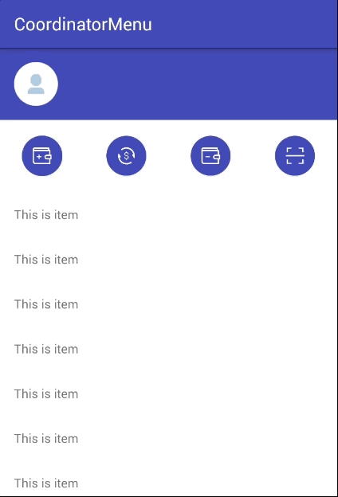
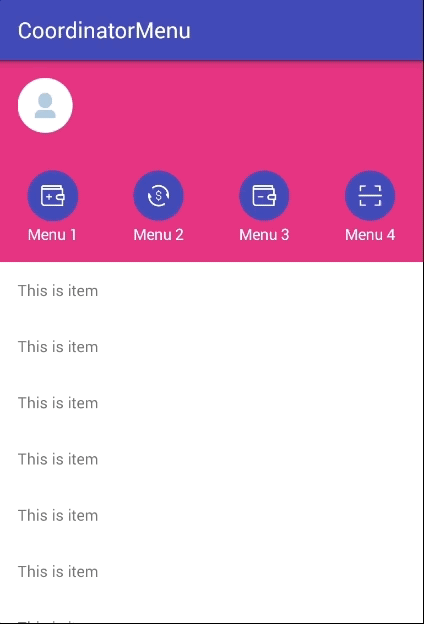

[]( https://android-arsenal.com/details/1/7188 )
# CoordinatorMenu


  
  
  
  
  
  
  
 
---


# Table of Contents

1. [Gradle Dependency](https://github.com/ATHBK/CoordinatorMenu#gradle-dependency)
   1. [Repository](https://github.com/ATHBK/CoordinatorMenu#repository)
   2. [Dependency](https://github.com/ATHBK/CoordinatorMenu#dependency)
2. [Basic Usage](https://github.com/ATHBK/CoordinatorMenu#basic-usage)
   1. [CoordinatorMenu XML](https://github.com/ATHBK/CoordinatorMenu#coordinatormenu-xml)
   2. [Attributes](https://github.com/ATHBK/CoordinatorMenu#coordinatormenu-attr )
3. [Init Java](https://github.com/ATHBK/CoordinatorMenu#init-from-java)
4. [License](https://github.com/ATHBK/CoordinatorMenu#license)

   
---

# Gradle Dependency


#### Repository

Add this in your root `build.gradle` file (**not** your module `build.gradle` file):

```gradle
allprojects {
	repositories {
		...
		maven { url 'https://jitpack.io' }
	}
}
```

#### Dependency

Add this to your module's `build.gradle` file:

```gradle
dependencies {
	compile 'com.github.ATHBK:CoordinatorMenu:v1.0'
}
```

---

# Basic Usage

#### CoordinatorMenu XML

To use this CoordinatorMenu in your layout simply copy and paste the xml below. 

```xml
<com.athbk.coordinatormenu.CoordinatorMenuLayout xmlns:android="http://schemas.android.com/apk/res/android"
    xmlns:app="http://schemas.android.com/apk/res-auto"
    xmlns:tools="http://schemas.android.com/tools"
    android:layout_width="match_parent"
    android:layout_height="match_parent"
    android:id="@+id/menuLayout"
    app:menu_size="25dp"
    app:menu_big_size="50dp"
    app:menu_big_padding_top="16dp"
    app:menu_big_padding_bottom="16dp"
    app:menu_padding_left="82dp"
    app:menu_title_text_position="none"
    app:menu_padding_item="16dp">

</com.athbk.coordinatormenu.CoordinatorMenuLayout>
````

#### CoordinatorMenu Attr 

There are several other attributes that can be used to configure background menu, size of item menu, size of text, ...

| Attrrs                          |                           |  type                             | option                   |
| --------------------------------|:-------------------------:|-----------------------------------|--------------------------|
| menu_size                       | size's normal menu                                            |dimension|                |
| menu_padding_left               | padding left of normal menu                                   |dimension|                |
| menu_padding_right              | padding right of normal menu                                  |dimension|                |
| menu_padding_item               | distance between items                                        |dimension|                |
| menu_big_size                   | size's big menu                                               |dimension|                |
| menu_big_padding_top            | padding top of big menu                                       |dimension|                |
| menu_big_padding_bottom         | padding bottom of big menu                                    |dimension|                |
| menu_background_resource        |                                                               |dimension|                |
| menu_background_color           |                                                               |color    |                |
| menu_background_spacing_resource|                                                               |dimension|                |
|menu_background_spacing_color    |                                                               |color    |                |
|menu_title_text_size	            |                                                               |dimension|                |
|menu_title_text_position         | position of title's menu                                      |enum     | none or bottom |
|menu_title_text_color            |                                                               |color    |                |
|menu_title_padding_top           |                                                               |dimension|                |
|menu_title_padding_bottom        |                                                               |dimension|                |
|menu_ratio_change_view           |the rate at which the view changes 	                          |float    |                |
|menu_ratio_max_width_title       | maximum ratio of width's text compared to the size of the menu|float    |                |
|menu_title_text_style            |                                                               |enum     |none or bold    |

---

# Init from Java

#### Java

How to use in.
*Step1: Create Adapter's menu extends CoordinatorMenuAdapter. Ex basic adapter:
```java
public class MenuAdapter extends CoordinatorMenuAdapter {

    Context context;

    public MenuAdapter(Context context) {
        this.context = context;
    }

    @Override
    public MenuViewHolder onCreateHeaderViewHolder(ViewGroup parent) {
        View view = LayoutInflater.from(parent.getContext()).inflate(R.layout.layout_header, parent, false);
        return new HeaderVH(view);
    }

    @Override
    public MenuViewHolder onCreateContentViewHolder(ViewGroup parent) {
        View view = LayoutInflater.from(parent.getContext()).inflate(R.layout.layout_content_rv, parent, false);
        return new ContentVH(view);
    }

    @Override
    public BaseMenuProp onBindMenuView(int position) {
        switch (position){
            case 0:
                return new BaseMenuProp("Menu 1", R.drawable.ic_home_topup, R.drawable.ic_home_topup_big);
            case 1:
                return new BaseMenuProp("Menu 2", R.drawable.ic_home_tranfer, R.drawable.ic_home_menu_tranfer_big);
            case 2:
                return new BaseMenuProp("Menu 3", R.drawable.ic_home_castout, R.drawable.ic_home_castout_big);
            case 3:
                return new BaseMenuProp("Menu 4", R.drawable.ic_home_scan, R.drawable.ic_home_scan_big);
        }
        return null;
    }

    @Override
    public int getCountMenu() {
        return 4;
    }


    @Override
    public void onItemMenuClickListener(int position) {
        Intent intent = new Intent(context, MenuStyle2Activity.class);
        context.startActivity(intent);
        Log.e("TAG", "Menu : " + position + " click");
    }

    class HeaderVH extends MenuViewHolder {

        public HeaderVH(View view) {
            super(view);
        }
    }

    class ContentVH extends MenuViewHolder {
        RecyclerView recyclerView;

        private RVAdapter adapter;

        public ContentVH(View view) {
            super(view);

            recyclerView = (RecyclerView) view.findViewById(R.id.recyclerView);
            adapter = new RVAdapter();
            recyclerView.setLayoutManager(new LinearLayoutManager(context));
            recyclerView.setAdapter(adapter);
        }
    }
```
*Step2: 
```java	
	CoordinatorMenuLayout menuLayout = (CoordinatorMenuLayout) findViewById(R.id.menuLayout);

        MenuAdapter adapter = new MenuAdapter(this);
        menuLayout.setMenuAdapter(adapter);
```
---
# License

    Copyright 2017 ATHBK

    Licensed under the Apache License, Version 2.0 (the "License");
    you may not use this file except in compliance with the License.
    You may obtain a copy of the License at

       http://www.apache.org/licenses/LICENSE-2.0

    Unless required by applicable law or agreed to in writing, software
    distributed under the License is distributed on an "AS IS" BASIS,
    WITHOUT WARRANTIES OR CONDITIONS OF ANY KIND, either express or implied.
    See the License for the specific language governing permissions and
    limitations under the License.
